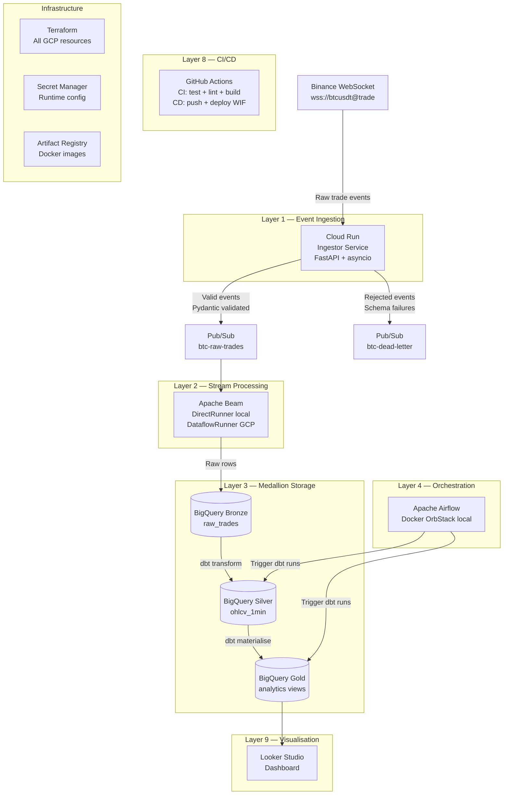

# Crypto Market Data Platform

> **Enterprise Near Real-Time Market Data Platform** — A production-grade, cloud-native data engineering project demonstrating end-to-end streaming architecture on Google Cloud Platform.

[](https://github.com/vivekghodke-labs/crypto-market-data-platform/actions/workflows/ci.yml)
[](https://github.com/vivekghodke-labs/crypto-market-data-platform/actions/workflows/cd.yml)

---

## Overview

This platform ingests live BTC/USDT trade events from the Binance WebSocket stream, processes them through a cloud-native streaming pipeline, stores them in a Medallion architecture on BigQuery, and surfaces analytics via Looker Studio — all deployed on GCP free tier.

**Industry context:** This architecture mirrors real-world patterns used in trading platforms, commodity price monitoring, and financial market data infrastructure — domains where near-real-time data quality, schema validation, and fault-tolerant ingestion are non-negotiable.

---

## Architecture



---

## Tech Stack

| Layer | Technology | Purpose |
|---|---|---|
| Ingestion | Python 3.12, FastAPI, websockets | WebSocket client + health API |
| Messaging | Google Cloud Pub/Sub | Decoupled, durable event streaming |
| Stream Processing | Apache Beam (DirectRunner / Dataflow) | OHLCV windowed aggregation |
| Storage | BigQuery (Medallion: Bronze/Silver/Gold) | Analytical data warehouse |
| Transformation | dbt Core | SQL-based data modelling |
| Orchestration | Apache Airflow (local Docker) | dbt pipeline scheduling |
| Infrastructure | Terraform | All GCP resources as code |
| Secrets | Google Secret Manager | Runtime configuration |
| Container Registry | Google Artifact Registry | Docker image storage |
| CI/CD | GitHub Actions + Workload Identity Federation | Keyless GCP deployment |
| Visualisation | Looker Studio | Real-time analytics dashboard |

---

## Sprint Progress

- [x] **Sprint 1** — Layer 1: Event Ingestion (Cloud Run + Pub/Sub + Terraform)
- [ ] **Sprint 2** — Layer 2: Stream Processing (Apache Beam OHLCV pipeline)
- [ ] **Sprint 3** — Layer 3: Medallion Transformation (dbt Bronze→Silver→Gold)
- [ ] **Sprint 4** — Layer 4: Orchestration (Airflow DAGs on OrbStack)
- [ ] **Sprint 5** — Layer 9: Visualisation (Looker Studio dashboard)

---

## Repository Structure

```
crypto-market-data-platform/
├── .github/workflows/
│   ├── ci.yml              # PR: lint, test, Docker build, Terraform validate
│   └── cd.yml              # main: build → push → Cloud Run deploy (WIF)
├── infra/terraform/
│   ├── main.tf             # Provider + API enablement
│   ├── variables.tf        # All input variables
│   ├── outputs.tf          # Post-apply resource references
│   ├── iam.tf              # Service accounts + WIF
│   ├── pubsub.tf           # Topics + subscriptions
│   ├── cloudrun.tf         # Ingestor Cloud Run service
│   ├── artifact_registry.tf
│   ├── secrets.tf
│   ├── gcs.tf              # Bronze landing bucket
│   └── bigquery.tf         # Medallion datasets + Bronze table schema
├── services/ingestor/
│   ├── src/
│   │   ├── main.py         # FastAPI app + lifespan management
│   │   ├── websocket_client.py  # Binance WS + exponential backoff
│   │   ├── schema.py       # Pydantic v2 trade event validation
│   │   ├── publisher.py    # Pub/Sub publish logic
│   │   └── logger.py       # JSON structured logger (GCP format)
│   ├── tests/              # 52 unit tests (pytest)
│   ├── Dockerfile          # Multi-stage, linux/amd64, non-root
│   └── requirements*.txt
├── beam/                   # Sprint 2
├── dbt/                    # Sprint 3
├── airflow/                # Sprint 4
├── docker-compose.yml      # Local: ingestor + Pub/Sub emulator (OrbStack)
├── Makefile                # make run | test | lint | tf-plan | tf-apply
└── .env.example
```

---

## Local Development Setup

### Prerequisites

- OrbStack installed and running on Apple Silicon Mac
- Docker CLI available
- `gcloud` CLI installed (`brew install google-cloud-sdk`)
- Python 3.12+ with pip

### 1. Clone and configure

```bash
git clone https://github.com/vivekghodke-labs/crypto-market-data-platform.git
cd crypto-market-data-platform
cp .env.example .env
```

### 2. Start the local stack

```bash
make run
```

This starts:
- **Pub/Sub emulator** on `localhost:8085`
- **pubsub-init** (creates topics + subscriptions, then exits)
- **Ingestor service** on `localhost:8080` (connected to emulator, streaming live BTC trades from Binance)

### 3. Verify it's working

```bash
# Check health
curl http://localhost:8080/health

# Expected response:
# {
#   "status": "healthy",
#   "service": "ingestor",
#   "stats": {
#     "messages_processed": 42,
#     "messages_rejected": 0,
#     "reconnect_attempts": 0,
#     "running": true
#   }
# }
```

### 4. Run unit tests

```bash
make test
```

### 5. Stop the stack

```bash
make stop
```

---

## GCP Bootstrap Guide

### Step 1 — Create GCP project

```bash
gcloud projects create vg-ind-2026 --name="Crypto Market Data Platform"
gcloud config set project vg-ind-2026
# Enable billing via GCP Console (required for Cloud Run + Artifact Registry)
```

### Step 2 — Create Terraform state bucket

```bash
gsutil mb -p vg-ind-2026 -l us-central1 gs://vg-ind-2026-tf-state
gsutil versioning set on gs://vg-ind-2026-tf-state
```

### Step 3 — Apply Terraform

```bash
cd infra/terraform
terraform init
make tf-plan
make tf-apply
```

### Step 4 — Bootstrap secrets

```bash
echo -n "vg-ind-2026" | gcloud secrets versions add crypto-gcp-project-id --data-file=-
echo -n "btc-raw-trades" | gcloud secrets versions add crypto-pubsub-raw-trades-topic --data-file=-
echo -n "btc-dead-letter" | gcloud secrets versions add crypto-pubsub-dead-letter-topic --data-file=-
echo -n "wss://stream.binance.com:9443/ws/btcusdt@trade" | gcloud secrets versions add crypto-binance-ws-url --data-file=-
```

### Step 5 — Configure GitHub Actions secrets

```bash
# Get WIF provider name from Terraform output
terraform output workload_identity_provider

# Get CI/CD service account email
terraform output cicd_service_account_email
```

Add to GitHub repository → Settings → Secrets → Actions:
- `GCP_WORKLOAD_IDENTITY_PROVIDER` → value from above
- `GCP_SERVICE_ACCOUNT` → value from above

Add to GitHub repository → Settings → Variables → Actions:
- `GCP_PROJECT_ID` → `vg-ind-2026`
- `GCP_REGION` → `us-central1`
- `AR_REPOSITORY` → `crypto-platform`
- `CLOUD_RUN_SERVICE` → `crypto-ingestor`

---

## Author

**Vivek Ghodke**
Enterprise Data Architect · Cloud Architect · Agentic AI Expert · Certified Data Engineer · Certified AI-102
[GitHub](https://github.com/vivekghodke-labs) · [LinkedIn](https://linkedin.com/in/vivekghodke)
